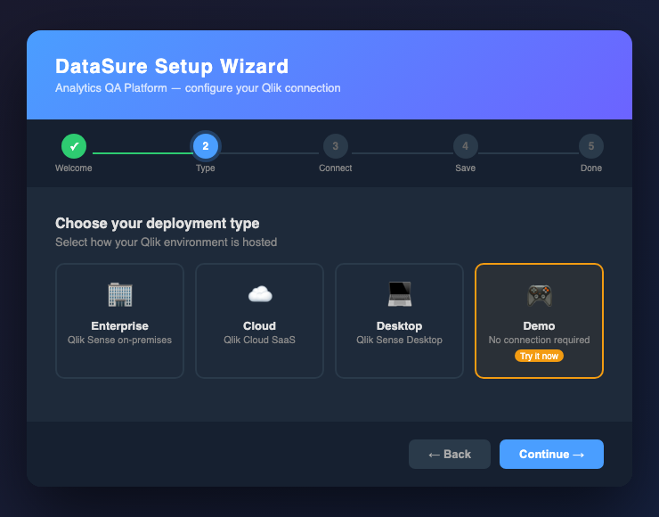
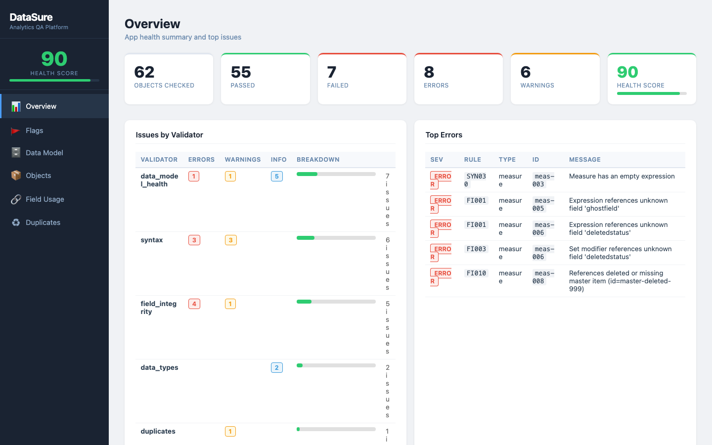
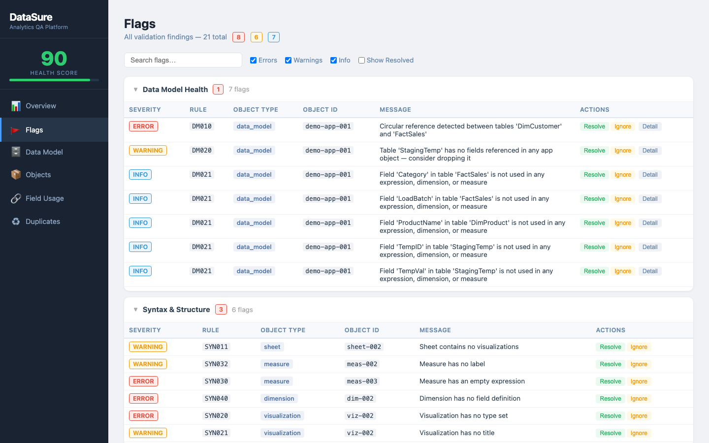
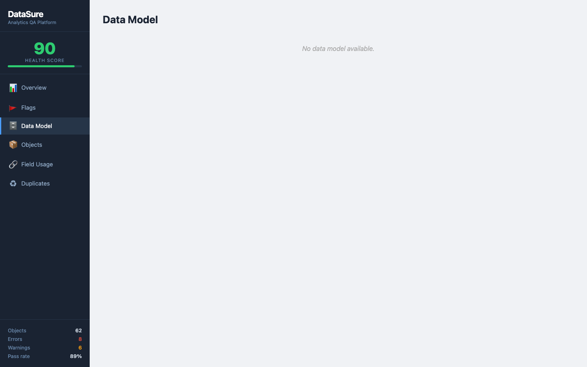
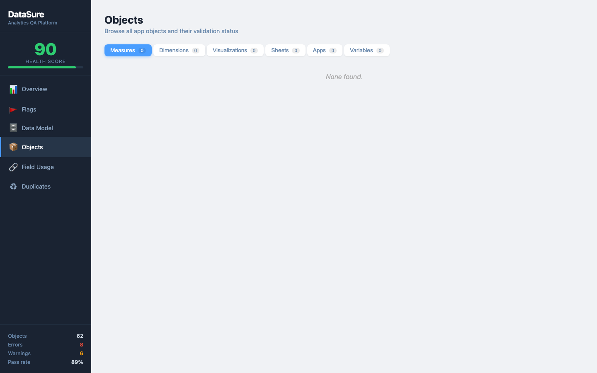
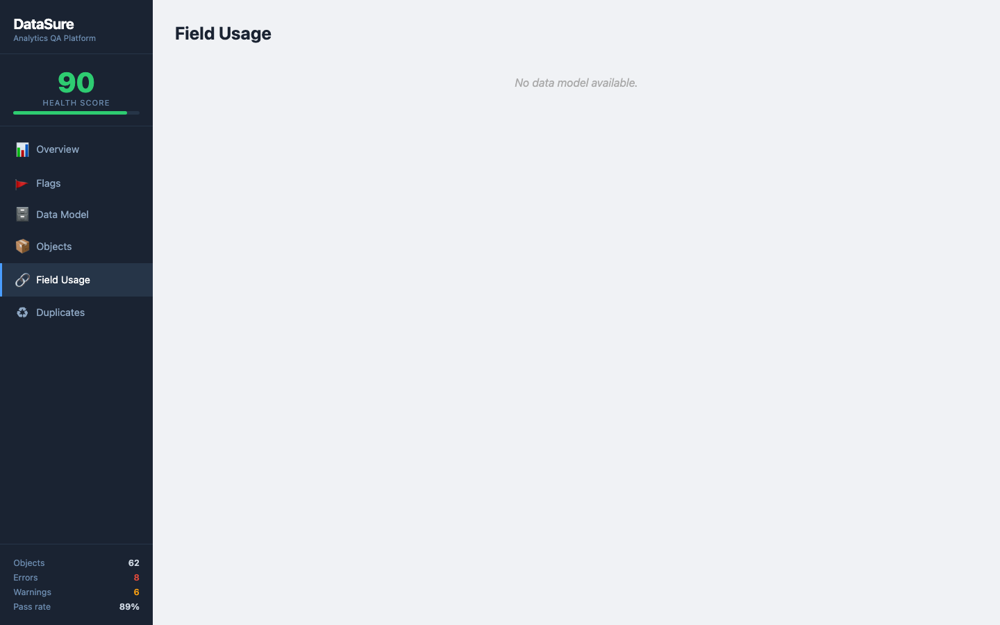
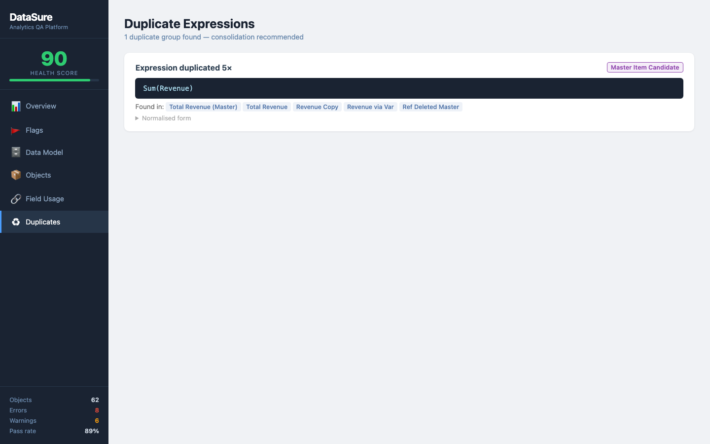
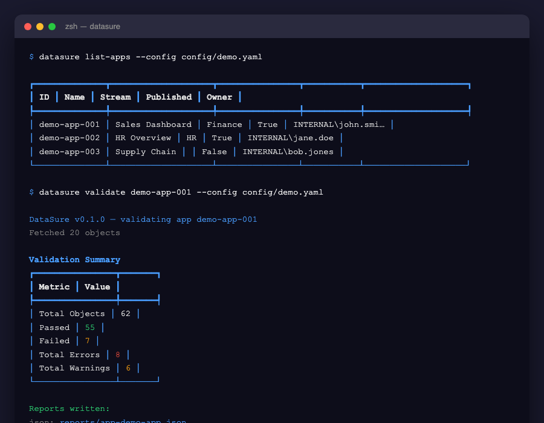

# DataSure — Analytics QA Platform for Qlik Sense

> Automated quality assurance, validation and reporting for Qlik Sense applications — on-premises, cloud, or demo mode with no server required.

[](https://python.org)
[](LICENSE)
[](https://qlik.com)

---

## Overview

DataSure scans your Qlik Sense apps and automatically flags issues across five quality dimensions: syntax errors, data type mismatches, broken field references, data model health problems, and duplicate expressions. It produces rich multi-page HTML reports you can share with your team — no Qlik installation needed to view them.

### Setup Wizard

The guided setup wizard runs in your browser and gets you connected in under 2 minutes.



---

## Report Pages

DataSure generates a self-contained HTML report with six dedicated analysis pages.

### 1. Overview — Health Score & Summary

A at-a-glance health score (0–100) plus breakdown of errors and warnings by category.



### 2. Flags — All Issues

Every validation issue in one searchable, filterable table. Filter by severity (Error / Warning / Info) or by validator module. Expand any row for full detail.



### 3. Data Model Health

Synthetic key detection, circular reference analysis, unused tables, and field coverage — all surfaced with actionable details.



### 4. Objects Browser

Browse all app objects (Measures, Dimensions, Visualizations, Sheets, Variables) in a tabbed view. See pass/fail status for each object at a glance.



### 5. Field Usage

Which fields are used in expressions and which are never referenced — helps identify dead fields in your data model.



### 6. Duplicate Expressions

Groups of identical or near-identical expressions across measures and visualizations — candidates for Master Item consolidation.



---

## CLI Commands

DataSure is driven from the terminal with a clean, colour-rich interface.



```
datasure setup             Launch the browser-based setup wizard
datasure list-apps         List all apps on your Qlik server
datasure validate <APP_ID> Run full validation and generate reports
datasure test-connection   Verify your Qlik connection settings
datasure demo              Quick demo using built-in sample data
datasure version           Show version information
```

---

## Validation Modules

| Module | Rule IDs | What it checks |
|---|---|---|
| **Syntax** | SYN001–SYN040 | Missing titles, empty expressions, unbalanced brackets, missing labels |
| **Data Types** | DT001–DT021 | Numeric aggregators on date fields, format string mismatches, conflicting type tags |
| **Field Integrity** | FI001–FI010 | Unknown field references, key fields in expressions, deleted master item references |
| **Data Model Health** | DM001–DM021 | Synthetic keys, circular references, unused tables, low field coverage |
| **Duplicate Expressions** | DUP001 | Identical or normalised-equivalent expressions across measures/charts |

---

## Installation

### Mac / Linux (one command)

```bash
bash install.sh
```

This script:
- Checks for Python 3.10+
- Creates a dedicated virtual environment at `~/.datasure/venv`
- Installs DataSure and all dependencies
- Creates a `datasure` launcher in `~/.local/bin`
- Adds it to your PATH
- Launches the setup wizard automatically

### Windows (PowerShell)

```powershell
.\install.ps1
```

Same flow — creates `datasure.bat` launcher in `%USERPROFILE%\.local\bin`.

### Manual install (pip)

```bash
python -m venv .venv && source .venv/bin/activate
pip install -e .
datasure setup
```

---

## Quick Start

### Option A — Demo Mode (no Qlik server needed)

```bash
# Use the included demo config
datasure list-apps --config config/demo.yaml
datasure validate demo-app-001 --config config/demo.yaml
```

This runs against 3 built-in sample apps with intentional issues seeded across all five validation modules — perfect for exploring the tool without any Qlik connection.

### Option B — Qlik Sense On-Premises

```bash
datasure setup   # follow the wizard: choose Enterprise, enter host + cert paths
datasure list-apps
datasure validate <YOUR_APP_ID>
```

See `config/enterprise.yaml` for all available options.

### Option C — Qlik Cloud (SaaS)

```bash
datasure setup   # choose Cloud, enter tenant URL + API key
datasure list-apps
datasure validate <YOUR_APP_ID>
```

See `config/cloud.yaml` for all available options.

---

## Configuration

DataSure stores its config at `~/.datasure/config.yaml`. You can also pass `--config <path>` to any command.

### Enterprise (on-premises) example

```yaml
qlik:
  mode: enterprise
  host: qlik.yourcompany.com
  port: 443
  virtual_proxy: ""
  verify_ssl: true
  ca_cert: ~/.datasure/certs/root.pem
  cert_path: ~/.datasure/certs/client.pem
  key_path: ~/.datasure/certs/client_key.pem
  user_directory: INTERNAL
  user_id: sa_repository

validation:
  enabled_modules:
    - syntax
    - data_types
    - field_integrity
    - data_model_health
    - duplicates

report:
  output_dir: ./reports
  formats: [html, json]
```

### Qlik Cloud example

```yaml
qlik:
  mode: cloud
  tenant: mycompany.us.qlikcloud.com
  api_key: eyJhbGciOiJFUzM4...
```

### Demo mode

```yaml
qlik:
  mode: demo
```

---

## Project Structure

```
datasure/
├── src/datasure/
│   ├── cli.py                    # Typer CLI entry-point
│   ├── setup_wizard.py           # Browser-based setup wizard (embedded HTTP server)
│   ├── config/
│   │   └── settings.py           # Pydantic v2 settings (enterprise / cloud / demo)
│   ├── connectors/
│   │   └── qlik_sense.py         # Qlik QRS API + Cloud API + demo data connector
│   ├── core/
│   │   └── validation_engine.py  # Threaded validation orchestrator
│   ├── validators/
│   │   ├── base.py               # BaseValidator, ValidationIssue, Severity
│   │   ├── syntax.py             # SYN rules
│   │   ├── data_types.py         # DT rules
│   │   ├── field_integrity.py    # FI rules (stateful, primed per-app)
│   │   ├── data_model_health.py  # DM rules
│   │   └── duplicates.py         # DUP rules (cross-object, run after all objects)
│   └── reporting/
│       └── generator.py          # Self-contained HTML + JSON report generator
├── config/
│   ├── demo.yaml
│   ├── enterprise.yaml
│   └── cloud.yaml
├── tests/
│   ├── test_validators.py
│   └── test_validation_engine.py
├── screenshots/                  # Report and UI screenshots
├── install.sh                    # Mac/Linux installer
├── install.ps1                   # Windows installer
└── pyproject.toml
```

---

## Requirements

- Python 3.10 or higher
- For Qlik on-premises: certificate files exported from Qlik Management Console
- For Qlik Cloud: API key from the cloud console (Settings → API Keys)
- For Demo mode: no Qlik installation required

---

## Running Tests

```bash
.venv/bin/pytest tests/ -v
```

15 tests covering all five validation modules and the validation engine.

---

## Roadmap

| Phase | Status | Features |
|---|---|---|
| Phase 1 | ✅ Complete | Syntax, Data Types, Field Integrity, Data Model Health, Duplicates |
| Phase 2 | ✅ Complete | Qlik on-prem connector, Qlik Cloud connector, setup wizard, demo mode |
| Phase 3 | Planned | Performance analysis, load script analysis, resource optimisation |
| Phase 4 | Planned | Plugin architecture, community extensions |
| Phase 5 | Planned | Tableau and Power BI connectors |

---

## License

MIT License — free to use, modify, and distribute.
